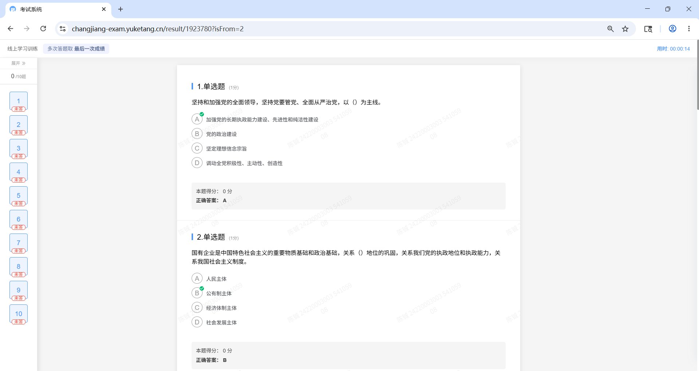

# Yuketang-Extractor

自动化提取与整理雨课堂课程题库。

## 项目结构

```
├── extractor.py            # Selenium 爬虫：从雨课堂答题平台抓取题目与正确答案
├── deduplicate.py          # 去重脚本：将题库.txt 去重并转换为 Markdown 格式
├── example.png             # 使用方法中的示例截图
└── 题库.txt                # （运行生成）爬虫原始输出
```

## 环境要求

- Python 3.8+
- Chrome 浏览器
- Selenium WebDriver

```bash
pip install selenium
```

## 使用方法

### 1. 启动 Chrome 调试模式

按 `Win + R`，输入以下命令并回车：

```
chrome.exe --remote-debugging-port=9222 --user-data-dir="D:\chrome_temp"
```

### 2. 登录雨课堂并打开题库

在刚启动的 Chrome 窗口中，登录雨课堂，进入题库答题页面。

### 3. 交卷后保留答案页面

交卷后，仅保留含有题目和正确答案的网页标签页。



达成图片效果后，运行提取脚本：

```bash
python extractor.py
```

### 4. 多次运行后去重

多次运行直到覆盖所有题目，然后运行去重脚本：

```bash
python deduplicate.py
```

脚本会删减重复题目并输出 Markdown 文件。

## 题目格式

抓取后的题目以固定分隔符 `------------------------------` 分隔，每条题目包含：

- **题号**：`【第 N 题】`
- **题型**：单选题 / 多选题 / 判断题 + 分值
- **题目正文**
- **选项**：A. / B. / C. / D. ...
- **正确答案**

去重后的 Markdown 文件中，每道题格式如下：

```markdown
## 第 N 题

**单选题**（1分）

题目正文...
- **A.** 选项内容
- **B.** 选项内容

> **正确答案：A**
```

## 免责声明

本项目仅供个人学习复习使用。
